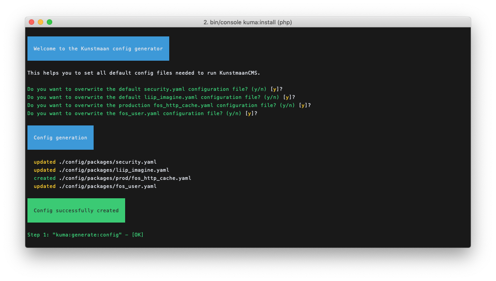

# Installation with KunstmaanCMS Skeleton

Installation with our Standard Edition is deprecated. If you still need this documentation you can find it at [The old way: Standard Edition](./standard-edition.md)

## Create your project with KunstmaanCMS Skeleton

Since Symfony 4 we do not use a Standard Edition anymore, instead we created our own skeleton (based upon the website-skeleton from Symfony). We have Flex recipes for all of our bundles so installation will be a breeze.
The first step to create your new KunstmaanCMS project is the following: 

```bash
composer create-project kunstmaan/cms-skeleton myprojectname
```
 


At the end of the composer install you will see that Symfony Flex will configure our recipes.
 


At this stage we recommend to add all these files into version control. What version control system and what vcs hosting you use is up to you. This example assumes [Git](http://git-scm.com) and [GitHub](https://github.com).

Create a new repository (in most cases a private one). Don't add any files from the GitHub interface to start with.


Then execute these commands in your project directory to initialise the git repository, in this example `~/Development/myprojectname/`

```bash
git init
git add .
git commit -m "Clean install of the KunstmaanCMS"
git remote add origin https://github.com/USERNAME/MyProject.git
git push -u origin master
```

At this point refreshing the page for your repository on GitHub will show you your files.

## Guided installation

```
bin/console kuma:install
```

> Configure your `DATABASE_URL` in the `.env` file before you proceed with the install. 

> You might run into some issues if don't have the imagick extension installed. Make sure you have the necessary software installed as stated in our [system requirements](./system-requirements.md)

 

This command will ask you a few questions and than it will run the following commands as subcommands. This list is just for clarity of what is happening and in what order it needs to be executed. That way if you want to do this manually and not use the installer, this is your reference as to how you need to proceed.

```bash
bin/console kuma:generate:bundle #Only do this for Symfony 3.x
bin/console kuma:generate:config #Only do this for Symfony 4.x
bin/console kuma:generate:default-site
bin/console doctrine:database:create
bin/console doctrine:schema:drop
bin/console doctrine:schema:create
bin/console doctrine:fixtures:load
bin/console assets:install
bin/console kuma:generate:admin-tests
```


For this installation we will install a demo site and also install the tests for the generated pages and pageparts. As you can see, the defaults for these options are set to `no`. For most use cases that will be the default and thus you can just hit `enter`.

## Config generator

Next we will enter the `Kunstmaan config generator`. It will ask you if you want to overwrite the default configuration for:

* Security: `config/packages/security.yaml`
* Liip Imagine: `config/packages/liip_imagine.yaml`
* Fos Http Cache: `config/packages/prod/fos_http_cache.yaml`
* Fos User: `config/packages/fos_user.yaml`

We suggest that you overwrite it during a new installation, but if you are upgrading you also can choose not to overwrite and then it wil generate a `package-name.yaml.example` file. You can then do a manual comparison of the existing file and the newly created example and make the necessary changes. For now, we just stick with the defaults. 



## Default site generator

Next up is the `Kunstmaan default site generator`. 

This generator is the base of the whole installation. If you are attempting to do a manual installation you will have to execute this generator. Without it you will have a hard time to get started with the CMS as it generates some important parts you absolutely need.

To start it will ask you for a tablename `prefix`. The default is `app_` which is fine for most but if you want you can change it. You will see the prefix in the generated pages/pageparts on the `@ORM\Table(name="app_home_pages")` annotation.

Next question is to which url the `BrowserSync` should be pointed at. This is part of the frontend workflow that will be generated. 

After that it will start the generation of all the necessary files. Here is a summary of what it contains:
 
* A barebones selection of pages, pageparts, adminlists, controllers, twig files, config files, etc
* A Groundcontrol configuration ~ gulpfile.babel.js. Groundcontrol is a build tool based on [gulp](http://gulpjs.com) to automate and enhance mostly front-end development workflows
* A basic selection of user interface elements, sass files, etc
* The needed fixtures to setup the CMS


> Since we answered `yes` to the question `demosite`, the subcommand will be run with the option `--demosite`. This will result in a replica of our [demo site](https://demo.kunstmaancms.be).

## Initialising the database

When this is done, the installer will start with the creation of the database schema and load all the generated fixtures to fill it. When the fixtures command is executed, it will ask to purge the database. You can just answer `y` and continue.


## Assets install

When the database has been setup we will run the assets install command. This will output the compiled assets for the admin section of the KunstmaanCMS. If you want add some extra js to the compiled javascript you can do so as stated in the freshly generated `assets/admin/js/admin-bundle-extra.js` file.

> Adding extra css/js to the admin section is a default feature in the KunstmaanCMS frontend setup. If you are not using this setup you will need to implement this logic yourself.

## Admin tests generator

Because at the beginning of the installer we said that we would like to install the admin tests, these will be generated as a last step in the installation procedure. These tests are a set of Unit and Behat test features that test that your site is working correctly. It will test logging in to the administration interface, it will create a page and tries to enter every pagepart. Most generators will generate extra features when you add features later on in development.

## Install finished, what now?


Now the install is finished you should be able to browse to the admin section of the website (ie: https://127.0.0.1/en/admin) on the environment of your choice, and be greeted with the following screens.
> In this example we used the default provided symfony webserver `bin/console server:start`


> Note: this was generated with the option `--demosite`. If you do the install without the demosite you will end up with a empty `HomePage`


## KunstmaanCMS Frontend workflow

First make sure you installed [node.js](https://node.js.org/) v10 (or higher).
You can test your node version by running `node -v`.
> You can use the [nvm](https://github.com/creationix/nvm) to use correct node version. Use the `nvm install` command.

During the install procedure a `buildUI.sh` script has been generated in the root of your project. When you execute that script it will start building the frontend assets using these steps:

```bash
nvm use
npm install
npm run build
```
> Checkout the script as to what it does exactly and make changes as you see fit.


Once that has finished and you browse to the website on the environment of your choice it should show you the website with minimalistic/demo styling.


