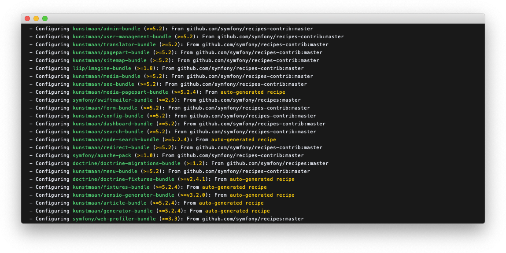

# Installation with KunstmaanCMS Skeleton

Installation with our Standard Edition is deprecated. [The old way: Standard Edition](./standard-edition.md)

## Create your project with KunstmaanCMS Skeleton

Since Symfony 4 we do not use a Standard Edition anymore, instead we created our own skeleton (based upon the website-skeleton from Syfmony). We have Flex recipes for all of our bundles so installation will be a breeze.
The first step to create your new KunstmaanCMS project is the following: 

```sh
export SYMFONY_ENDPOINT=https://flex.symfony.com/r/github.com/symfony/recipes-contrib/620 
composer create-project kunstmaan/cms-skeleton myprojectname dev-master
```
> Sidenote: Our recipes are still under review. Until they are merged into the master of the `symfony/recipes-contrib` repository we need to manually set the flex endpoint to our PR

 


At the end of the composer install you will see that Symfony Flex will configure our recipes.
 



At this stage we recommend to add all these files into version control. What version control system and what vcs hosting you use is up to you. This example assumes [Git](http://git-scm.com) and [GitHub](https://github.com).

Create a new repository (in most cases a private one). Don't add any files from the GitHub interface to start with.


Then execute these commands in your project directory to initialise the git repository, in this example `~/Development/myprojectname/`

```
git init
git add .
git commit -m "Clean install of the KunstmaanCMS"
git remote add origin https://github.com/USERNAME/MyProject.git
git push -u origin master
```

At this point refreshing the page for your repository on GitHub will show you your files.

## Guided installation

```
bin/console kuma:install
```

> Configure your `DATABASE_URL` in the `.env` file before you proceed with the install. 

> You might run into some issues if don't have the imagick extension installed. Make sure you have the necessary software installed as stated in our [system requirements](./system-requirements.md)

 

